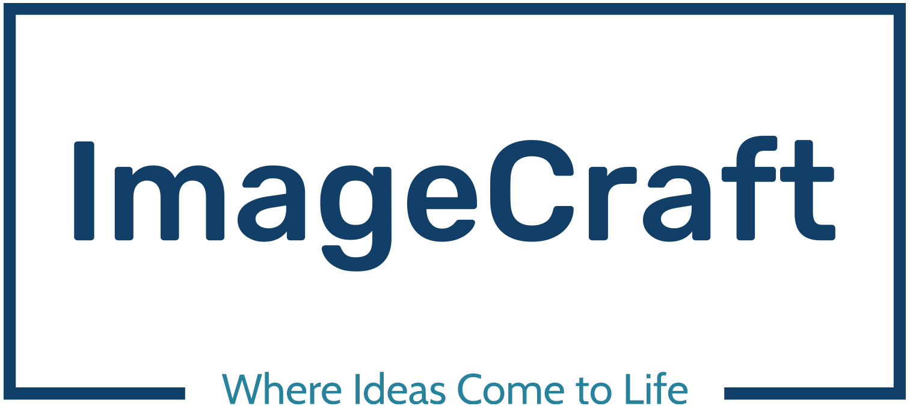
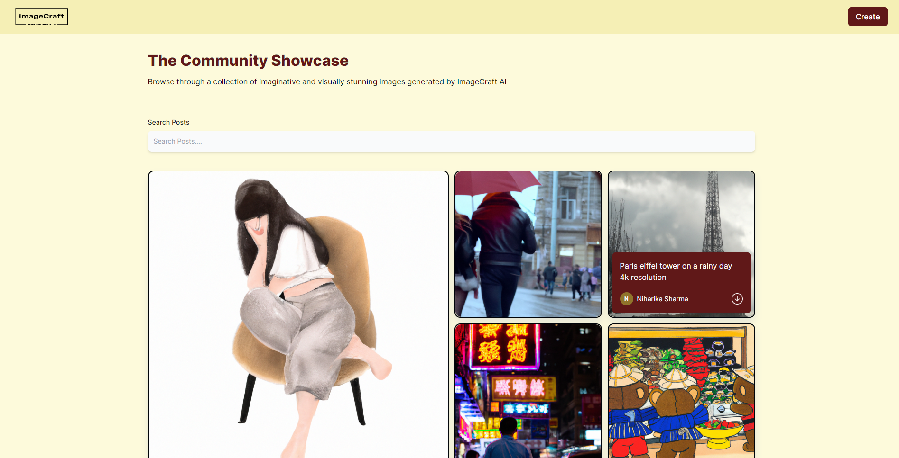
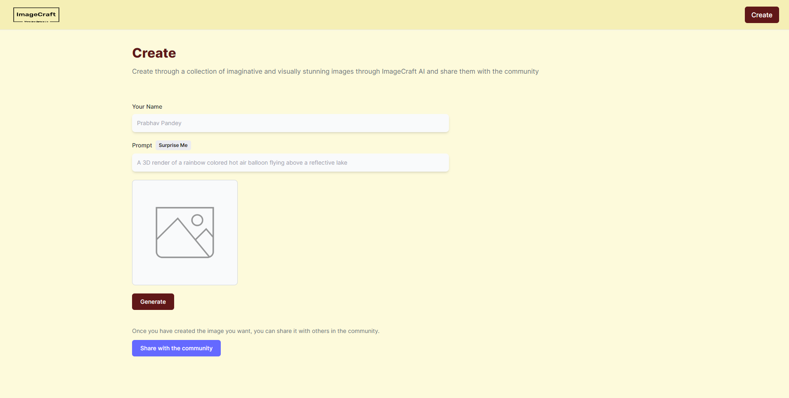

# ImageCraft - Where Ideas comes to life....

"ImageCraft" Empowering Creativity with AI Image Generation. This cutting-edge tool harnesses the power of MERN and Tailwind CSS to effortlessly generate stunning images through the magic of artificial intelligence.

## WebSite Link
https://image-craft.netlify.app/

## Features
**ImageCraft** offers the following features to its users:

- **AI Image Generation:** The website offers an intuitive interface where users can generate unique and creative images using artificial intelligence algorithms. Users can input various parameters, such as styles, themes, or specific image characteristics, and the AI system will generate customized images based on those inputs.

- **User-Friendly Interface:** The website is designed to be user-friendly, ensuring that users can easily navigate and interact with the AI image generation tool. The interface may include intuitive controls, sliders, or input fields for adjusting image properties and preferences. 

- **Real-Time Image Preview:** As users tweak the image generation settings, the website may provide a real-time preview of the resulting images. This allows users to see the immediate impact of their adjustments and make further refinements if desired.

- **Community Gallery:** The website may have a dedicated section or gallery where users can browse and explore images that have been shared by other members of the ImageCraft community. This gallery serves as a source of inspiration and showcases the diverse creations generated by users.

## Screenshots

**Home Page**

**Dark Mode**

## Technology Stack:
**ImageCraft** is developed using the MERN stack, which includes:

- **MongoDB:** The database used to store user information, posts, and other data.
- **Express.js:** The web framework used to build the backend server.
- **React:** The frontend library used to build the user interface.
- **Node.js:** The runtime environment used to execute server-side JavaScript.
- **Tailwind CSS Styling:** Tailwind CSS is a utility-first CSS framework that enables developers to rapidly build customized and responsive user interfaces. It suggests that the website may have a modern, clean, and visually appealing design.

## Future Scope:
- **Admin Panel:** The application has an admin panel where the administrator can manage users, posts, categories, and other settings.

- **Profile Management:** Users can update their profiles by adding their profile picture, name, and bio.

- **Search:** Users can search for posts by keywords, categories, and hashtags.

- **Notification:** Users receive notifications for likes, comments, and new followers

- **Uploading Post from any Directory:** User can upload or use images from anywhere not only from the assest folder. This will be done using the database, by creating seperate collection of images.
